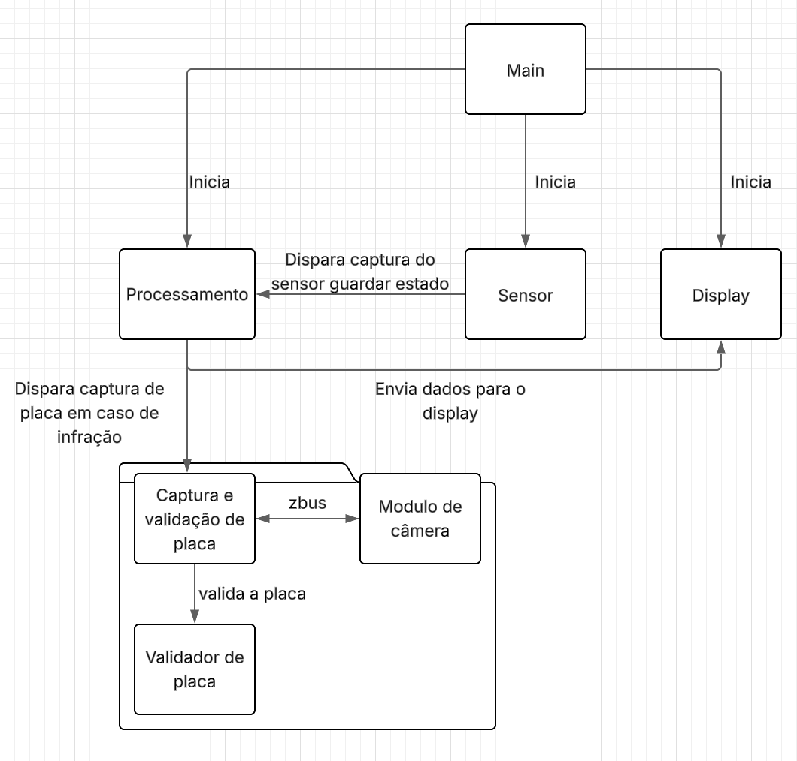
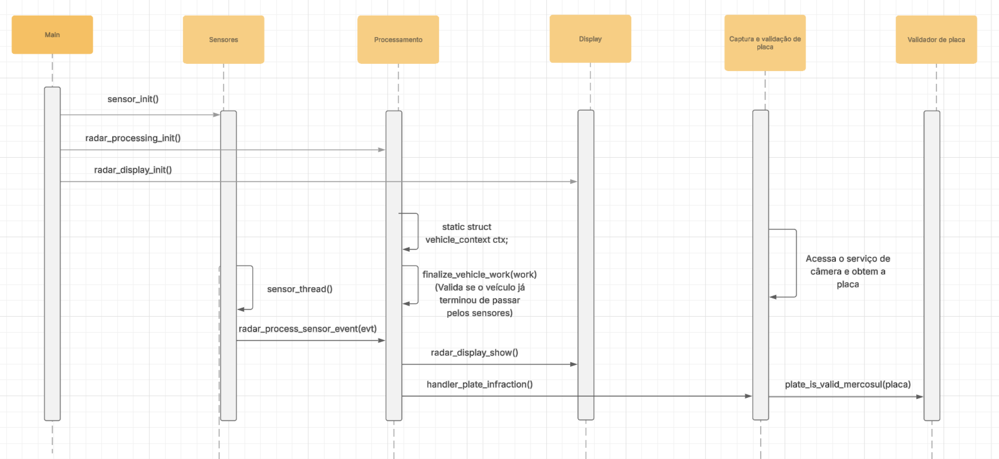

# Radar Eletrônico

A aplicação pretende simular o funcionamento de um radar eletrônico que tem as seguintes funcionalidades:

-   Leitura dos sensores para cálculo de velocidade
-   Exibição do resultado em display e console
-   Captura de imagem de câmera e leitura de placa
-   Exibição e validação da placa em caso de infração

## Módulos criados

Foram criados cinco módulos responsáveis pelo processo de captura, processamento, display e validação.
Além disso, foi integrado o módulo de câmera responsável por capturar imagem da câmera (de forma simulada) e
enviar a placa para ser validada.

-   Sensores em `sensor.c`: configura os sensores com o GPIO e chama a função para processamento da captura dos sensores.
-   Processamento em `radar_processing.c`: responsável por guardar o estado atual da aplicação e realizar a medição de velocidade, classificação do veículo e status.
-   Exibição em `radar_display.c`: escreve em display dummy e imprime no console com ANSI para cores.
-   Validação de placas em `vehicle_infraction_plate.c`: quando uma infração é cometida ele é disparado e acessa o serviço de câmeras, recebe a placa e valida ela com o módulo de placas.
-   Captura de placas `plate.c`: espera uma placa no formato mercosul e valida se a placa é válida.
-   `sensor_sim.c`: simula a passagem de veículos no radar.

## Configuração

Variáveis do `Kconfig`:

-   `RADAR_SENSOR_DISTANCE_MM`: distância em mm entre os sensores (padrão: 1000).
-   `RADAR_SPEED_LIMIT_LIGHT_KMH`: limite km/h para veículos leves (padrão: 80).
-   `RADAR_SPEED_LIMIT_HEAVY_KMH`: limite km/h para veículos pesados (padrão: 60).
-   `RADAR_WARNING_THRESHOLD_PERCENT`: percentual do limite para acionar status de atencao (padrão: 90).
-   `RADAR_CAMERA_FAILURE_RATE_PERCENT`: porcentagem de falha na leitura de placa (padrão: 10).

## Execução do projeto

### Versões
- Zephyr version: 4.1.99
- Zephyr-sdk-0.17.1


Está sendo utilizada a board mps2_an385 para testes em simulação, para rodar o projeto, basta executar os comandos de buid e execução abaixo

```
west build -b mps2/an385 -p always
west build -t run

```

## Execução de testes

Para os testes basta executar os comandos abaixo

```
west build -b mps2/an385 test -p always
west build -t run

```

## Arquitetura

A arquitetura consiste em módulos que estão dividos da seguinte forma: sensor, processamento, visualização e validação. Dessa forma,
temos um thread rodando para os sensores que que comunica via chama de função ao processamento. Nesse passo temos um worker que fica esperando un
timou finalizar para passar para a etapa de classificação, visualização e detecção de placa.

Para a detecção de placa foi utilizado o módulo fornecido, sendo ele integrado ao projeto e, com as placas fornecidas, é feita a validação para
as placas do mercosul.

### Estrutura

Abaixo podemos ver a estrutura de pastas do projeto. A organização é simples. Consistem uma pasta para os módulos, src para os arquivos de protótipo e implementação
e test com os arquivos para execução dos testes.

````
.
├── CMakeLists.txt
├── Kconfig
├── docs
│   └── modulos.png
│   └── sequencia.png
├── modules
│   └── camera_service
│       ├── CMakeLists.txt
│       ├── include
│       │   └── camera_service.h
│       ├── Kconfig.camera_service
│       ├── src
│       │   ├── camera_service_priv.h
│       │   └── camera_service.c
│       └── zephyr
│           └── module.yml
├── prj.conf
├── README.md
├── sample.yaml
├── src
│   ├── main.c
│   ├── plate.c
│   ├── plate.h
│   ├── radar_display.c
│   ├── radar_display.h
│   ├── radar_processing.c
│   ├── radar_processing.h
│   ├── sensor_sim.c
│   ├── sensor.c
│   ├── sensor.h
│   ├── vehicle_infraction_plate.c
│   └── vehicle_infraction_plate.h
└── test
    ├── CMakeLists.txt
    ├── Kconfig
    ├── prj.conf
    └── src
        ├── main.c
        ├── test_plate.c
        ├── test_radar_display.c
        └── test_radar_processing.c

````

### Módulos

Abaixo temos os módulos do sistemas em diagrama. Veja que o modulo principal inicia as configurações, e os módulas abaico dela ficam conversando para
guardar e processar os resultados objetos dos sensores e posteriormente exibir os resultados



Outros diagrama que podemos ver é o de sequência, que mostra o passo a passo da chamada das funções do sistema




